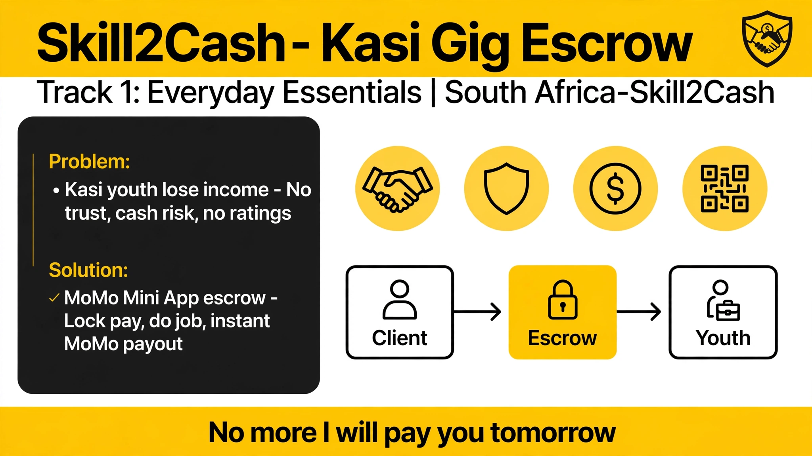

# Skill2Cash

**Kasi Gig Escrow Mini App**  
*MoMo Mini App Hackathon 2026 – South Africa*

> **Tagline:** No more “I’ll pay you tomorrow”. Do the job. Get paid instantly.

---

### The Problem

In townships across South Africa, most youth rely on piece jobs — gardening, plumbing, hair braiding, phone repairs, cleaning.

There is almost zero trust:

- Clients fear paying upfront and getting a no-show  
- Workers fear finishing the job and hearing “come back tomorrow”  
- Cash is risky and leaves no record  
- No ratings, no proof, no digital footprint

Result: daily income is lost and informal workers stay invisible to the formal economy.

---

### The Solution

**Skill2Cash** is a Mini App that lives *inside* the MoMo app. No extra download.

**Core flow:**

1. Client posts a job and locks the payment via **MoMo Collections** (escrow)
2. Nearby worker accepts the job
3. Worker completes the job and uploads before/after photos
4. Client taps “Job Done” → **MoMo Disbursement** pays the worker instantly
5. Both rate each other — building a digital reputation

---

### Why MoMo Mini App?

- Lives where the money already is  
- Works on low data  
- Payment locked by MTN = instant trust  
- Scalable across other MoMo markets

---

### MoMo APIs Used

| API                  | Purpose                                      |
|----------------------|----------------------------------------------|
| Collections          | Client locks funds into escrow               |
| Disbursements        | Instant payout to worker                     |
| Transaction Status   | Confirm funds are locked                     |
| Party Lookup / KYC   | Verify both parties are MoMo registered      |

---

### MVP Scope (Solo)

- Post a job + lock payment  
- Accept a job  
- Upload proof photos  
- One-tap “Job Done” → instant payout  
- Simple 1–5 star rating  

---

### Tech Stack

- Frontend: MoMo Mini App SDK + React  
- Backend: Node.js + Supabase (Auth, DB, Storage)  
- Payments: MTN MoMo Sandbox  
- Hosting: Azure Static Web Apps / MoMo Cloud

---

### Roadmap

| Timeline             | Goal                                           |
|----------------------|------------------------------------------------|
| Hackathon (2–3 Sept) | Working escrow flow in sandbox                 |
| Month 1              | Pilot with 30–50 youth in Pretoria/Hammanskraal|
| Month 3              | Dispute centre + basic multi-language          |

---

### Built by

**Tshepiso Tk Tsotetsi**  
Product Lead – Hammanskraal / Gauteng  
Building solo for the MoMo Mini App Hackathon 2026

---

### Run (Sandbox)

```bash
git clone https://github.com/kenosi10/skill2cash-momo-miniapps.git
cd skill2cash-momo-miniapps
npm install

# .env
MOMO_COLLECTIONS_SUBSCRIPTION_KEY=your_key
MOMO_DISBURSEMENT_SUBSCRIPTION_KEY=your_key
MOMO_TARGET_ENVIRONMENT=sandbox

npm run dev

---

## Pitch Slide


